# PipeGuard

**Defending against the `curl | bash` attack vector**

---

## TL;DR (Executive Summary)

**Problem:** macOS users have been trained for years to run `curl | bash` and bypass security controls (`xattr -d com.apple.quarantine`). Attackers now exploit this via AI-generated "installation guides" (AMOS/ClickFix campaigns). MITRE classifies this as [T1204.004](https://attack.mitre.org/techniques/T1204/004/).

**Solution:** PipeGuard intercepts pipe-to-interpreter patterns, scans content with YARA/AV before execution, and blocks known malware. Three-layer defense: ZLE keyboard interception → hardened shell wrappers → preexec audit logging.

**Status:** Design complete. Implementation in progress.

```bash
# Instead of this (dangerous):
curl https://example.com/install.sh | bash

# PipeGuard intercepts automatically:
# → Downloads to temp
# → Scans with YARA (10 rule categories) + Apple XProtect rules + ClamAV
# → Shows threat level: 🟡 Low | 🟠 Medium | 🔴 High
# → Blocks or prompts before execution
```

---

## Key Findings (For Researchers)

### The "Human Prompt Injection" Problem

| AI Prompt Injection | Human "Prompt Injection" |
|---------------------|--------------------------|
| Malicious instructions hidden in data | Malicious commands hidden in "helpful" guides |
| AI can't distinguish user intent from injected commands | User trained to not question Terminal commands |
| Bypasses safety filters via context manipulation | Bypasses Gatekeeper via copy-paste |
| Exploits trust in data sources | Exploits trust in AI/expert sources |

Users have been **pre-conditioned** by years of tutorials to:
- Run arbitrary `curl | bash` commands
- Remove quarantine attributes reflexively
- Trust formatted instructions from authoritative sources

### macOS Security Control Gap

| Control | Status for `curl \| bash` |
|---------|---------------------------|
| Gatekeeper | **Bypassed** - curl doesn't set quarantine |
| XProtect | **Bypassed** - no file to scan before execution |
| TCC | Partially effective - may prompt for folder access |
| SIP | Not applicable - user-initiated |

**Apple's design decision:** Command-line tools don't set quarantine. The security model assumes Terminal users know what they're doing.

### Attack Evolution Timeline

1. **Legacy** (2010s): `curl | bash` normalized in developer tooling
2. **ClickFix** (2024): Fake CAPTCHAs trick users into pasting commands ([500% increase](https://www.microsoft.com/en-us/security/blog/2025/08/21/think-before-you-clickfix-analyzing-the-clickfix-social-engineering-technique/))
3. **AI Poisoning** (2025): Shared ChatGPT/Grok conversations deliver [AMOS infostealer](https://www.malwarebytes.com/blog/news/2025/12/google-ads-funnel-mac-users-to-poisoned-ai-chats-that-spread-the-amos-infostealer)
4. **Agentic Exploitation** (2025): [Comet browser MCP API](https://labs.sqrx.com/comet-mcp-api-allows-ai-browsers-to-execute-local-commands-dec185fb524b) allows local command execution via prompt injection

---

## Technical Architecture

### Detection Pipeline

```mermaid
flowchart TD
    A[/"📥 Input (script content)"/] --> B

    subgraph Stage1["Stage 1: YARA Pattern Matching (~5ms)"]
        B["10 rule categories<br/>Custom rules supported"]
    end

    B --> C

    subgraph Stage2["Stage 2: AV Integration (~50-200ms)"]
        C["Apple XProtect YARA rules<br/>ClamAV (clamd socket)"]
    end

    C --> D

    subgraph Stage3["Stage 3: Sandbox Analysis (~1-3s)"]
        D["macOS sandbox-exec dry-run<br/>Captures file/network/process<br/>Only for medium threats"]
    end

    D --> F{{"🎯 Threat Level"}}

    F -->|"1-6"| G["🟡 Low<br/>Warn + Prompt"]
    F -->|"7-8"| H["🟠 Medium<br/>Sandbox + Approve"]
    F -->|"9-10"| I["🔴 High<br/>Block"]
```



> **Note:** [PipeGuard Pro](https://github.com/SecurityRonin/pipeguard-pro) adds Stage 4: Cloud AI Analysis with encrypted payload transmission for enterprise deployments.

### YARA Rule Categories

| Category | Severity | Rationale |
|----------|----------|-----------|
| Base64 Obfuscation | 5 | Common in staged attacks |
| Staged Downloads | 7 | Script downloads more scripts |
| Reverse Shells | 10 | Immediate compromise indicator |
| Persistence | 8 | LaunchAgents, crontab, rc files |
| Privilege Escalation | 7 | sudo stdin, osascript admin |
| Crypto Wallet Targeting | 9 | AMOS primary objective |
| Quarantine Bypass | 9 | Explicit security control bypass |
| AMOS/ClickFix IOCs | 10 | Known campaign indicators |
| Environment Harvesting | 6 | Credential theft precursor |
| Anti-Analysis | 5 | Sandbox/VM detection |

### Shell Interception Layers

| Layer | Mechanism | Coverage | Bypass Difficulty |
|-------|-----------|----------|-------------------|
| **ZLE Binding** | Keyboard intercept at Enter | Interactive shells | Easy (`\curl`) |
| **Hardened Wrappers** | PATH-shadowed functions | Scripts, CI, subshells | Moderate |
| **Preexec Logging** | Audit trail | All commands | N/A (detection only) |

**Defense in depth:** Bypassing one layer still triggers another.

---

## Threat Model

### In Scope

- `curl | bash` and variants (`wget | sh`, `fetch | zsh`)
- Piped script execution patterns
- Known malware families (AMOS, ClickFix variants)
- Social engineering via AI-generated guides

### Out of Scope

- Downloaded executables (Gatekeeper handles these)
- Kernel exploits / sandbox escapes
- Determined attacker with local access
- Hardware implants

### Limitations

1. **Sandbox evasion:** Malware can detect sandbox and stay dormant
2. **Novel patterns:** Zero-day attacks may not match YARA rules
3. **User override:** `--force` flag exists (can be disabled via MDM)
4. **Shell-specific:** Only protects bash/zsh/sh interpreters

---

## Implementation

### Technology Stack

- **Language:** Rust (memory safety, single binary, performance)
- **YARA:** yara-rust bindings
- **Encryption:** age (modern, audited)
- **Shell:** Zsh ZLE + Bash preexec

### Project Structure

```
pipeguard/
├── src/
│   ├── detection/     # YARA, ClamAV, sandbox
│   ├── interception/  # Shell integration
│   ├── config/        # Settings, allowlist
│   └── logging/       # Audit trail
├── rules/
│   └── core.yar       # Default YARA rules
└── shell/
    ├── pipeguard.zsh  # Zsh integration
    └── pipeguard.bash # Bash integration
```

### Build

```bash
cargo build --release
```

> **Enterprise:** See [PipeGuard Pro](https://github.com/SecurityRonin/pipeguard-pro) for cloud AI analysis, fleet policy, MDM integration, and central rule distribution.

---

## Comparison with Existing Tools

### Why PipeGuard?

No existing tool specifically addresses the `curl | bash` attack vector with pre-execution interception. Current solutions either:
- Detect **after** execution (EDR/behavioral)
- Block **binaries** not scripts (Santa)
- Monitor **network** not shell pipes (LuLu)
- Require **manual review** (download-then-execute workflow)

### Competitive Landscape

| Tool | Approach | curl\|bash Coverage | Pre-Execution | Open Source |
|------|----------|---------------------|---------------|-------------|
| **PipeGuard** | Shell interception + YARA | ✅ **Primary focus** | ✅ Yes | ✅ MIT |
| [Santa](https://github.com/northpolesec/santa) | Binary allowlisting | ❌ Scripts bypass | ❌ Binary only | ✅ Apache 2.0 |
| [Objective-See Tools](https://objective-see.org/tools.html) | Persistence/network monitor | ❌ Post-execution | ❌ No | ✅ GPL |
| [Sysdig Falco](https://falco.org/) | Runtime behavioral rules | ⚠️ Partial (post-exec) | ❌ No | ✅ Apache 2.0 |
| [osquery](https://github.com/osquery/osquery) | SQL-based system queries | ⚠️ Detection only | ❌ No | ✅ Apache 2.0 |
| [CrowdStrike Falcon](https://www.crowdstrike.com/en-us/platform/endpoint-security/falcon-for-macos/) | Cloud EDR | ⚠️ Behavioral detection | ❌ No | ❌ Commercial |
| [Jamf Protect](https://www.jamf.com/products/jamf-protect/) | macOS-native EDR | ⚠️ Behavioral detection | ❌ No | ❌ Commercial |

### PipeGuard's Unique Value

| Differentiator | Description |
|----------------|-------------|
| **Pre-execution interception** | Scans script content *before* any code runs—not after damage is done |
| **Shell-native integration** | ZLE binding intercepts at keystroke level; no kernel extension required |
| **curl\|bash specific** | Purpose-built for the exact attack vector, not general-purpose EDR |
| **Multi-stage detection** | YARA → XProtect → ClamAV → Sandbox (layered, not single-point) |
| **Gatekeeper gap coverage** | Addresses Apple's intentional design decision to not quarantine piped content |
| **ClickFix/AMOS focused** | YARA rules tuned for 2024-2025 campaign IOCs |
| **Transparent** | Open source (MIT)—security tools should be auditable |

> **Enterprise needs?** [PipeGuard Pro](https://github.com/SecurityRonin/pipeguard-pro) adds Cloud AI analysis, MDM integration, fleet policy, and central rule distribution.

### Detailed Tool Comparison

#### [Santa](https://github.com/northpolesec/santa) (Google → North Pole Security)
Binary authorization system using allowlists/blocklists. **Limitation:** Only controls *binary* execution—shell scripts piped to interpreters completely bypass Santa since `bash` itself is allowed.

#### [Objective-See Tools](https://objective-see.org/tools.html) (Patrick Wardle)
Excellent macOS security suite (BlockBlock, LuLu, KnockKnock). **Limitation:** Detects persistence and network activity *after* malware executes. No pre-execution script scanning.

#### [Sysdig Falco](https://sysdig.com/blog/friends-dont-let-friends-curl-bash/)
Runtime security with behavioral rules. Can monitor pipe installer child processes. **Limitation:** Detects suspicious *behavior* post-execution, not malicious *content* pre-execution.

#### [osquery](https://github.com/osquery/osquery)
Powerful system introspection via SQL. Includes [osx-attacks.conf](https://github.com/osquery/osquery/blob/master/packs/osx-attacks.conf) pack for reverse shell detection. **Limitation:** Query-based detection, not real-time interception.

#### Enterprise EDR (CrowdStrike, Jamf Protect, Kandji)
Full-featured endpoint security with behavioral analysis. **Limitation:** Designed for general threat detection, not specifically optimized for pipe-to-shell patterns. Detection typically post-execution.

---

## PipeGuard Pro

For enterprise deployments, [**PipeGuard Pro**](https://github.com/SecurityRonin/pipeguard-pro) adds:

| Feature | Description |
|---------|-------------|
| **Cloud AI Analysis** | Stage 4 detection with LLM-powered behavioral analysis |
| **Encrypted Transmission** | age encryption bypasses TLS inspection (Zscaler, Netskope) |
| **Fleet Policy** | MDM-enforced configuration (Jamf, Kandji, Mosyle, Intune) |
| **Central Rule Sync** | Automatic YARA rule updates across your fleet |
| **Audit Aggregation** | Centralized security event collection and analysis |
| **Threat Intel Feeds** | Integration with commercial threat intelligence |

Contact: enterprise@pipeguard.dev

---

## Related Work

### Academic Papers

#### Supply Chain & Installation Security
- P. Ladisa, H. Plate, M. Martinez, O. Barais. ["SoK: Taxonomy of Attacks on Open-Source Software Supply Chains."](https://arxiv.org/abs/2204.04008) *IEEE Symposium on Security and Privacy (S&P)*, 2023. — 107 attack vectors, 94 real-world incidents
- C. Huang et al. ["DONAPI: Malicious NPM Packages Detector using Behavior Sequence Knowledge Mapping."](https://www.usenix.org/conference/usenixsecurity24/presentation/huang-cheng) *USENIX Security*, 2024.
- M. Zimmermann et al. ["Small World with High Risks: A Study of Security Threats in the npm Ecosystem."](https://www.usenix.org/system/files/sec19-zimmermann.pdf) *USENIX Security*, 2019.

#### Provenance-Based Detection
- X. Han et al. ["You Are What You Do: Hunting Stealthy Malware via Data Provenance Analysis."](https://www.ndss-symposium.org/wp-content/uploads/2020/02/24167-paper.pdf) *NDSS*, 2020. — Script-based attack detection via system provenance
- W. U. Hassan et al. ["ORTHRUS: Achieving High Quality of Attribution in Provenance-based Intrusion Detection."](https://tfjmp.org/publications/2025-usenixsec.pdf) *USENIX Security*, 2025.
- B. Bilot et al. ["A Comprehensive Analysis of State-of-the-Art Provenance-based Intrusion Detection Systems."](https://www.usenix.org/system/files/usenixsecurity25-bilot.pdf) *USENIX Security*, 2025.

#### macOS Security
- J. Blochberger et al. ["State of the Sandbox: Investigating macOS Application Security."](https://dl.acm.org/doi/10.1145/3338498.3358654) *ACM CCS Workshop*, 2019.
- D. Blazakis. ["The Apple Sandbox."](https://www.researchgate.net/publication/228889694_The_Apple_Sandbox) *ISE*, 2011. — Foundational sandbox-exec research

#### YARA & Signature Detection
- A. Lockett. ["Assessing the Effectiveness of YARA Rules for Signature-Based Malware Detection and Classification."](https://arxiv.org/abs/2111.13910) *arXiv*, 2021.
- Z. Li et al. ["Malware Detection Using Automated Generation of YARA Rules on Dynamic Features."](https://dl.acm.org/doi/10.1007/978-3-031-17551-0_21) *SciSec*, 2022. — 97% accuracy with ML-generated rules

#### Shell & Code Injection
- K. Z. Snow et al. ["SHELLOS: Enabling Fast Detection and Forensic Analysis of Code Injection Attacks."](https://www.usenix.org/conference/usenix-security-11/shellos-enabling-fast-detection-and-forensic-analysis-code-injection) *USENIX Security*, 2011.

### Industry Research

#### Threat Intelligence
- Microsoft Threat Intelligence. ["Think Before You Click(Fix): Analyzing the ClickFix Social Engineering Technique."](https://www.microsoft.com/en-us/security/blog/2025/08/21/think-before-you-clickfix-analyzing-the-clickfix-social-engineering-technique/) Aug 2025. — 500%+ attack surge
- Proofpoint. ["ClickFix Social Engineering Technique Floods Threat Landscape."](https://www.proofpoint.com/us/blog/threat-insight/security-brief-clickfix-social-engineering-technique-floods-threat-landscape) 2025. — State-sponsored adoption
- HHS. ["ClickFix Attacks Sector Alert."](https://www.hhs.gov/sites/default/files/clickfix-attacks-sector-alert-tlpclear.pdf) Oct 2024. — Official TLP:CLEAR report
- Unit 42. ["Gatekeeper Bypass: Uncovering Weaknesses in a macOS Security Mechanism."](https://unit42.paloaltonetworks.com/gatekeeper-bypass-macos/) 2023.
- Unit 42. ["Preventing the ClickFix Attack Vector."](https://unit42.paloaltonetworks.com/preventing-clickfix-attack-vector/) Aug 2025.
- Malwarebytes. ["Google Ads Funnel Mac Users to Poisoned AI Chats that Spread AMOS Infostealer."](https://www.malwarebytes.com/blog/news/2025/12/google-ads-funnel-mac-users-to-poisoned-ai-chats-that-spread-the-amos-infostealer) Dec 2025.
- Huntress. ["AMOS Stealer: ChatGPT, Grok, and AI Trust."](https://www.huntress.com/blog/amos-stealer-chatgpt-grok-ai-trust) 2025.

#### Technical Analysis
- SNAKE Security. ["PipePunisher: Breaking the PIPE - Abusing PIPE to Shell Installations."](https://snakesecurity.org/blog/pipepunisher-exploiting-shell-install-scripts/) — Timing-based curl\|bash detection
- kicksecure. ["curl bash pipe - Security Discussion."](https://www.kicksecure.com/wiki/Dev/curl_bash_pipe) — Comprehensive risk analysis
- Sysdig. ["Friends Don't Let Friends Curl \| Bash."](https://www.sysdig.com/blog/friends-dont-let-friends-curl-bash/) — Falco-based defense approach
- Microsoft. ["Gatekeeper's Achilles Heel: Unearthing a macOS Vulnerability."](https://www.microsoft.com/en-us/security/blog/2022/12/19/gatekeepers-achilles-heel-unearthing-a-macos-vulnerability/) Dec 2022. — CVE-2022-42821
- WithSecure Labs. ["ESFang: Exploring the macOS Endpoint Security Framework for Threat Detection."](https://labs.withsecure.com/publications/esfang-exploring-the-macos-endpoint-security-framework-for-threat-detection)

### Reference Standards
- [MITRE ATT&CK T1204.004](https://attack.mitre.org/techniques/T1204/004/) - Malicious Copy and Paste (User Execution)
- [Apple Endpoint Security Framework](https://developer.apple.com/documentation/endpointsecurity) - Official documentation

### Tools & Libraries
- [YARA](https://virustotal.github.io/yara/) - Pattern matching swiss knife
- [age](https://age-encryption.org/) - Modern file encryption
- [bash-preexec](https://github.com/rcaloras/bash-preexec) - Preexec hooks for Bash
- [UXProtect](https://digitasecurity.com/uxprotect/) - XProtect rule visualization
- [Objective-See Tools](https://objective-see.org/tools.html) - macOS security suite

---

## Contributing

See [CONTRIBUTING.md](CONTRIBUTING.md) for guidelines.

### Research Collaboration

Interested in:
- Novel detection patterns for emerging threats
- Sandbox evasion detection techniques
- Behavioral analysis approaches
- User study on security control bypass training

Contact: [TBD]

---

## License

MIT License - Copyright (c) 2026 Security Ronin

Enterprise features are available in [PipeGuard Pro](https://github.com/SecurityRonin/pipeguard-pro) (proprietary license).

---

## Acknowledgments

- Apple Security Research for XProtect rule format documentation
- YARA project maintainers
- bash-preexec contributors
- The security research community documenting AMOS/ClickFix campaigns
